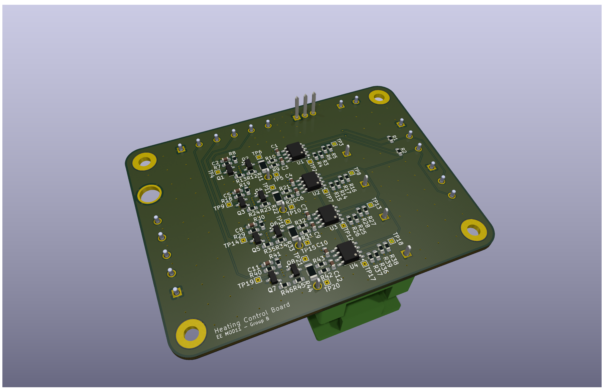

# Heating Board PCB

PCB for MOD11 project. Measures current of four channels and can PWM each channel using a PMOS circuit. 

Schematic: [Schematic](Exports/HeatingBoard.pdf) \
Test results: [Results](Testing/2025_03_31_Test_Plan_Heating_Board_Execution.pdf) \
Test code for Arduino Uno: [Code](Testing/test_code.ino)

## Implementation

The board has 5 connectors:

| Connector ID | Description |
| ------------ | ----------- |
| J1 | Battery connector, is used for power. |
| J2 | Input interface for control, has a PWM pin for each group and the input for the 3V3 power. |
| J3 | I2C connector, contains SDA, SCL and GND. **However, the GND pin is broken and does not work.** |
| J4 | I2C connector, contains SDA, SCL and GND. |
| J5 | Output to the heating sleeve. Has four outputs and a GND that power the sleeve. |

### Current sensors

The current sensors communicate over the I2C bus. They need 3V3 power, but not battery power. The addresses are stated below:

| Channel number | Address (HEX) | Address (BIN) | Shunt resistor value (mOhm) |
| -------------- | ------------- | ------------- | --------------------- |
| 1 | 0x45 | 1000101 | 101   |
| 2 | 0x44 | 1000100 | 101.2 |
| 3 | 0x41 | 1000001 | 100.5 |
| 4 | 0x40 | 1000000 | 100.6 |

The datasheet can be found using this [link](https://www.ti.com/lit/ds/symlink/ina219.pdf?ts=1744040891714&ref_url=https%253A%252F%252Fwww.ti.com%252Fproduct%252FINA219). We have tested the current sensors in combination with a small load and encountered problems with the PWM, since the current sensor would sometimes measure the full current and sometimes zero current. To solve this, we increased the sample size and PWM frequency. This does mean that the sensor takes ~ 70 ms to get new data. We recommend the following settings:

- 12 bit shunt resolution
- 128 samples per measurement
- 2.5 kHz PWM frequency

We have found pretty accurate results using these settings, only deviating a couple of mW from the power supply. The testing code can be found [here](Testing/test_code.ino). The resistor values of the current shunts are shown in the table with the addresses for the current sensors.

### MOSFETs

During testing, we found that the duty cycle of the output voltage starts deviating from the input duty cycle for higher PWM frequencies. We have tested this for frequencies of 2.5, 5 and 10 kHz and we recommend 2.5 kHz. All results can be found in the [test report](Testing/2025_03_31_Test_Plan_Heating_Board_Execution.pdf).

## 3D Images

